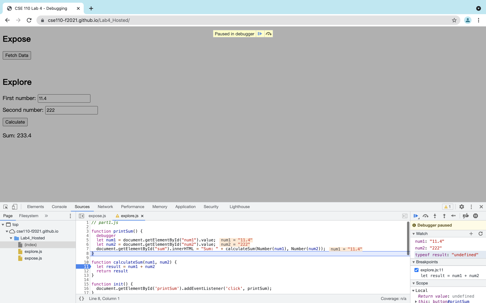

# DevTools - Debugging
1. ```num1```, ```num2```, and ```result``` are all strings instead of numbers so that when we do ```num1 + num2```, we concat two strings together instead of adding two numbers.
2. Convert ```num1``` and ```num2``` to numbers by using the function ```Number()```.

